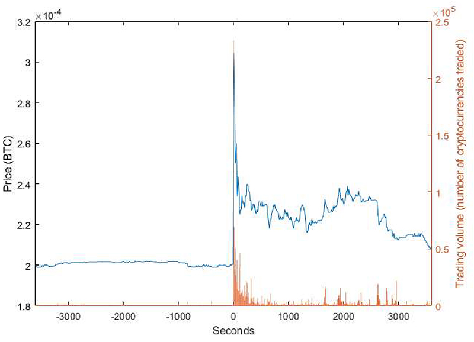
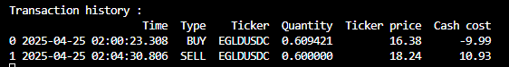
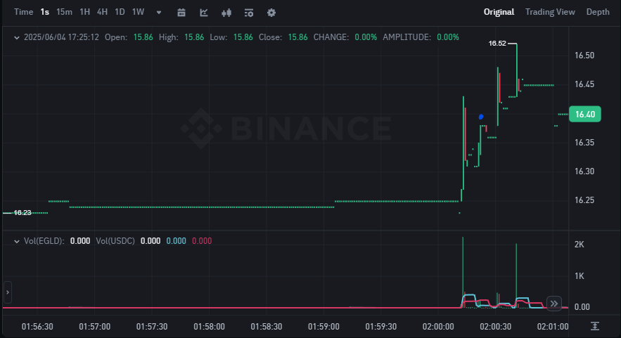
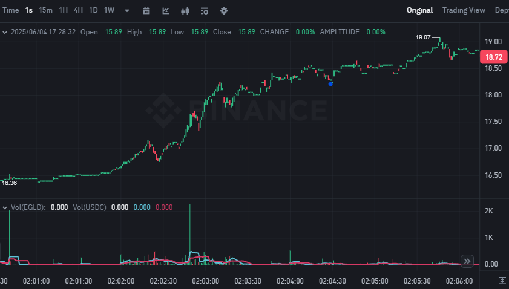

# Pump & Dump Detection and Trading Strategy

## Project Overview

This project focuses on **detecting pump and dump patterns** in cryptocurrency markets using Binance API Websockets and acting upon them using a defined **trading strategy**. It is designed to be modular and flexible, with the ability to run in both **live trading** and **backtesting** environments.

## What Is a Pump and Dump?

A **pump and dump** is a market manipulation scheme in which the price of a low-liquidity asset (often a small-cap crypto) is **artificially inflated ("pumped")** through exaggerated buying volume or misleading information, only for the manipulators to **sell off ("dump")** at the top, causing a sharp crash.

These schemes often exhibit the following features:

* A sudden and sharp increase in **price** and **volume**
* Most orders will be **taker** orders
* A short-lived peak, followed by a rapid decline
* Usually driven by hype or coordinated buying on social media or messaging groups (discord/telegram)

## Strategy Logic

The trading strategy is designed to:

1. **Detect pump signals** based on:
   * Abnormal changes in price, variation, volume and number of trades over multiple time windows (short-term (1m) vs long-term (1h))
   * Sudden spikes in volume
   * Surge in the number of trades
    if all conditions are met, they will be a double check to confirm the strength of the signal.
2. **Confirm the strength of the signal** using thresholds and comparison ratios.
3. **Place buy order** Buy accordingly depending on the configuration:
   * In **backtest mode**, all actions are simulated.
   * In **live trading mode**, real orders can be placed via an Binance API.
4. **Dynamic stop-loss update** based on the current maximum price.
   * Each time the ticker reaches a new high, the stopèloss is adjusted upward accordingly.
   * The stop-loss will be closer when the signal fades, as indicated by a drop in the z-score below a defined threshold.

**Z-score** = (Current Price − Moving Average) / Standard Deviation Average

---

## Architecture

The core design follows an **object-oriented approach** for maintainability and extensibility.

### 🔹 `TradingManager` (Abstract Base Class)

This class defines the **interface** for managing trades. It provides common methods for:

* Executing trades (`buy`, `sell`)
* Logging operations
* Updating portfolio state
* Receiving signals from the strategy

This class **can't be instantiated directly**.

---

### 🔹 `LiveTrading` (Child Class)

Implements the `TradingManager` interface for **real-time trading**. It:

* Connects to a live exchange API
* Places market or limit orders
* Monitors open positions and logs actual results

Useful for production deployment once your detection strategy is trusted.

---

### 🔹 `Backtesting` (Child Class)

Implements the `TradingManager` interface for **offline simulation**. It:

* Uses historical price and volume data
* Simulates trades as if they were placed live
* Measures strategy performance to optimize the parameters.

Great for evaluating and optimizing the detection algorithm before going live.

## MiCA reglementation

Due to MiCA reglementation some tickers are available in USDT but not in USDC, which forces us to use alternative pairs like TRY or BTC. For example, TA/USDC doesn't exist, so we rely on TA/TRY or TA/BTC  and conversions are therefore necessary.

## Example of Pump and Dump Detection

Here is a visual example illustrating how the detection algorithm works step by step.

### Overall Example

This image shows an example of the trades the bot made the full sequence of a detected pump and dump event, including price movements, volume spikes, and order flow.

### 🚀 Start of the Pump

At this stage, we observe a sudden increase in price, volume, and number of trades — a typical signal that the pump phase has begun.  
Each candlestick (kline) represents **one second**, allowing us to capture very short-term price movements.  
On the chart, the **blue dot marks the exact moment the bot executed the buy order**.

### 📉 End of the Pump

Shortly after, the price sharply reverses, marking the beginning of the dump phase. This is often accompanied by a drop in volume and a slowdown in trading activity.
On the chart, the **blue dot marks the exact moment the bot executed the sell order**.

In this specific case, the **maximum price reached during the pump was 19.11**, and the bot achieved a **10% profit** on the trade.